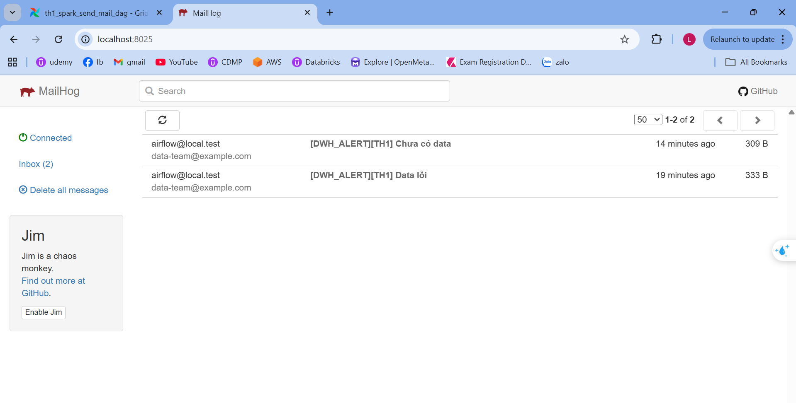

# ETL Data Quality Monitoring System

Dự án này triển khai hệ thống cảnh báo chất lượng dữ liệu cho Data Warehouse (DWH) sử dụng Apache Airflow để orchestrate, Apache Spark để xử lý dữ liệu, ClickHouse làm database, và Docker để containerize toàn bộ stack.

## Kiến trúc hệ thống

```text
Docker Compose Stack:
├── airflow-webserver (Airflow UI + Scheduler)
├── airflow-worker (Airflow task execution)
├── spark-master (Spark master node)
├── spark-worker (Spark worker node)
├── clickhouse (OLAP database)
├── mailhog (Email testing server)
└── postgres (Airflow metadata DB)
```

## Cấu trúc thư mục

```
.
├── airflow/                    # Airflow configuration
│   ├── Dockerfile
│   ├── requirements.txt
│   ├── dags/                   # DAG definitions
│   ├── include/                # Shared utilities
│   └── logs/                   # Airflow logs
├── spark/                      # Spark jobs
│   ├── Dockerfile
│   ├── conf/                   # Spark config
│   ├── jobs/                   # PySpark scripts
│   └── data/                   # Sample data (mounted)
├── clickhouse/                 # ClickHouse init scripts
├── postgres/                   # Postgres init scripts
├── shared/                     # Shared volumes
│   ├── checks/                 # Data quality results
│   ├── logs/                   # Application logs
│   └── raw/                    # Raw data storage
├── sample_data/                # Test data files
├── docker-compose.yml          # Docker orchestration
└── README.md
```

## Prerequisites

- Docker & Docker Compose
- Python 3.8+ (for local development)
- Git

## Setup và Chạy

1. **Clone repository:**
   ```bash
   git clone <repository-url>
   cd etl_airbyte_spark_clickhouse_docker
   ```

2. **Start services:**
   ```bash
   docker-compose up -d
   ```

3. **Access services:**
   - Airflow UI: http://localhost:8080 (admin/admin)
   - Spark Master UI: http://localhost:8081
   - MailHog UI: http://localhost:8025
   - ClickHouse: localhost:8123

4. **Stop services:**
   ```bash
   docker-compose down
   ```

## Logic Check Data Quality

Hệ thống thực hiện 3 bước kiểm tra chất lượng dữ liệu theo requirement:

### Step 1: Kiểm tra có dữ liệu kiểm tra trong ngày
- Query `tbl_data_check` cho ngày hiện tại
- Nếu không có record nào → Cảnh báo "Chưa có dữ liệu kiểm tra table trong ngày YYYY-MM-DD"

### Step 2: Lấy latest error records per table
- Join với `meta_table_names` để lấy danh sách tables cần monitor
- Lọc records có `STATUS != 'HAS_DATA'`
- Nếu không có error records → Message "Dữ liệu trong ngày đã đủ"

### Step 3: Validate cron matching
- Với mỗi error record, sử dụng `CHECK_DATE` để xác định `data_date = CHECK_DATE - 1 ngày`
- So sánh `data_date` với `DATA_NON_EXISTS_TIME` (cron pattern)
- Nếu `data_date` match cron → missing data tại `data_date` là bình thường (MATCH) và không alert
- Nếu `data_date` không match cron → missing data là bất thường (UNMATCH) và alert danh sách tables

## TH1: Spark tự gửi email

### Flow
```
Airflow DAG → Spark job → Query data → Check logic → Send email directly
```

### Key Features
- Spark xử lý toàn bộ logic check và gửi email
- Sử dụng CSV files: `tbl_data_check.csv`, `meta_table_names.csv`
- Cron parsing: Hỗ trợ patterns như `"* * * * 0,1"` (weekends), `"* * * * 2,3,4,5"` (weekdays)
- Cron matching: Khi CHECK_DATE match DATA_NON_EXISTS_TIME → MATCH (không alert), ngược lại UNMATCH (alert)

### Sample Code (th1_mock_check_and_send_mail.py)
```python
# Read input CSV and parse CHECK_DATE
df = (
    spark.read.option("header", True)
    .csv(TBL_DATA_CHECK_PATH)
    .withColumn("CHECK_DATE", to_timestamp(col("CHECK_DATE"), "yyyy-MM-dd HH:mm:ss"))
)

# Join with metadata to get DATA_NON_EXISTS_TIME from meta if present
df = (
    df.join(meta_df, df.TBL_NAME == meta_df.meta_full_tbl_schema_name, "inner")
    .withColumn(
        "DATA_NON_EXISTS_TIME",
        coalesce(meta_df.meta_data_non_exists_time, col("DATA_NON_EXISTS_TIME")),
    )
)

# Filter records only for today
df_today = df.filter((col("CHECK_DATE") >= start_of_today) & (col("CHECK_DATE") < start_of_next_day))

# If no rows today, send missing-data alert only when not weekend
if df_today.count() == 0:
    if not is_weekend:
        send_mail(
            f"[DWH_ALERT][TH1] Chưa có dữ liệu kiểm tra table trong ngày {format_date(today)}",
            f"TH1: Spark phát hiện chưa có dữ liệu kiểm tra table trong ngày {format_date(today)}."
        )
    return

# Select latest error row per table
error_window = Window.partitionBy("TBL_NAME").orderBy(desc("CHECK_DATE"))
df_errors = (
    df_today.filter(col("STATUS") != "HAS_DATA")
    .withColumn("row_num", row_number().over(error_window))
    .filter(col("row_num") == 1)
)

# Separate NO_DATA and ERROR_DATA, then compare with cron schedule
unmatch_no_data = process_rows(no_data_rows, "NO_DATA")
unmatch_error_data = process_rows(error_data_rows, "ERROR_DATA")

if unmatch_no_data or unmatch_error_data:
    send_mail(subject, body)
```
## TH2: Spark ghi kết quả, Airflow gửi email

### Flow
```
Airflow DAG → Spark job → Query data → Check logic → Write JSON result → Airflow read JSON → Send email
```

### Key Features
- Spark chỉ xử lý data và ghi kết quả JSON
- Airflow chịu trách nhiệm gửi email dựa trên status
- Conditional branching: NO_DATA → send alert, ERROR_DATA → prepare email, OK → finish
- Dynamic subject extraction từ Spark message
- Special handling cho "no records" case
- Cron matching: Khi CHECK_DATE match DATA_NON_EXISTS_TIME → MATCH (không alert), ngược lại UNMATCH (alert)

### Sample DAG (th2_airflow_send_mail_dag.py)
```python
def branch_result(**context):
    with open(RESULT_FILE, "r", encoding="utf-8") as f:
        result = json.load(f)

    context["ti"].xcom_push(key="dq_result", value=result)
    if result.get("no_data_tables") or result.get("error_data_tables"):
        return "prepare_combined_email"
    return "finish_ok"


def prepare_combined_email(**context):
    result = context["ti"].xcom_pull(task_ids="branch_after_spark", key="dq_result")
    is_no_records = (
        result.get("no_data_tables")
        and len(result.get("no_data_tables", [])) == 1
        and "No data quality check records found" in result.get("no_data_tables", [])[0]
    )

    # Extract date from message for subject
    message = result.get("message", "")
    date_match = re.search(r"(\d{4}-\d{2}-\d{2})", message)
    today = date_match.group(1) if date_match else datetime.now().strftime("%Y-%m-%d")

    if is_no_records:
        subject = f"[DWH_ALERT][TH2] Chưa có dữ liệu kiểm tra table trong ngày {today}"
        html = f"<h1>{message}</h1>"
    else:
        subject = f"[DWH_ALERT][TH2] Data Quality Alert [{today}]"
        sections = []
        if result.get("no_data_tables"):
            sections.append(
                "<h2>Status = NO_DATA</h2>"
                + "<p>Danh sách bảng thiếu dữ liệu:</p><ul>"
                + "".join(f"<li>{t}</li>" for t in result["no_data_tables"])
                + "</ul>"
            )
        if result.get("error_data_tables"):
            sections.append(
                "<h2>Status = ERROR_DATA</h2>"
                + "<p>Danh sách bảng có dữ liệu lỗi:</p><ul>"
                + "".join(f"<li>{t}</li>" for t in result["error_data_tables"])
                + "</ul>"
            )
        html = f"<h1>{message}</h1>" + "".join(sections)

    context["ti"].xcom_push(key="combined_email_subject", value=subject)
    context["ti"].xcom_push(key="combined_email_body", value=html)

run_spark_check >> branch_after_spark
branch_after_spark >> prepare_combined_email_task >> send_combined_email
branch_after_spark >> finish_ok
```

## DAG Airflow

```python
import json
import re
from datetime import datetime
from airflow import DAG
from airflow.operators.bash import BashOperator
from airflow.operators.python import BranchPythonOperator, PythonOperator
from airflow.operators.email import EmailOperator
from airflow.operators.empty import EmptyOperator

RESULT_FILE = "/opt/airflow/shared/dq/result.json"

def branch_result(**context):
    with open(RESULT_FILE, "r", encoding="utf-8") as f:
        result = json.load(f)

    context["ti"].xcom_push(key="dq_result", value=result)
    if result.get("no_data_tables") or result.get("error_data_tables"):
        return "prepare_combined_email"
    return "finish_ok"


def prepare_combined_email(**context):
    result = context["ti"].xcom_pull(task_ids="branch_after_spark", key="dq_result")
    is_no_records = (
        result.get("no_data_tables")
        and len(result.get("no_data_tables", [])) == 1
        and "No data quality check records found" in result.get("no_data_tables", [])[0]
    )
    message = result.get("message", "")
    date_match = re.search(r"(\d{4}-\d{2}-\d{2})", message)
    today = date_match.group(1) if date_match else datetime.now().strftime("%Y-%m-%d")

    if is_no_records:
        subject = f"[DWH_ALERT][TH2] Chưa có dữ liệu kiểm tra table trong ngày {today}"
        html = f"<h1>{message}</h1>"
    else:
        subject = f"[DWH_ALERT][TH2] Data Quality Alert [{today}]"
        sections = []
        if result.get("no_data_tables"):
            sections.append(
                "<h2>Status = NO_DATA</h2>"
                + "<p>Danh sách bảng thiếu dữ liệu:</p><ul>"
                + "".join(f"<li>{t}</li>" for t in result["no_data_tables"])
                + "</ul>"
            )
        if result.get("error_data_tables"):
            sections.append(
                "<h2>Status = ERROR_DATA</h2>"
                + "<p>Danh sách bảng có dữ liệu lỗi:</p><ul>"
                + "".join(f"<li>{t}</li>" for t in result["error_data_tables"])
                + "</ul>"
            )
        html = f"<h1>{message}</h1>" + "".join(sections)

    context["ti"].xcom_push(key="combined_email_subject", value=subject)
    context["ti"].xcom_push(key="combined_email_body", value=html)

with DAG(
    dag_id="th2_airflow_send_mail_dag",
    start_date=datetime(2026, 4, 1),
    schedule=None,
    catchup=False,
    tags=["airflow", "mail", "th2"],
) as dag:

    run_spark_check = BashOperator(
        task_id="run_spark_check",
        bash_command="""
        docker exec \
          -e OUTPUT_FILE=/opt/spark/shared/dq/result.json \
          spark-master \
          /opt/spark/bin/spark-submit \
          --master spark://spark-master:7077 \
          /opt/spark/jobs/th2_mock_check_write_result.py
        """
    )

    branch_after_spark = BranchPythonOperator(
        task_id="branch_after_spark",
        python_callable=branch_result
    )

    prepare_combined_email_task = PythonOperator(
        task_id="prepare_combined_email",
        python_callable=prepare_combined_email
    )

    send_combined_email = EmailOperator(
        task_id="send_combined_email",
        to="data-team@example.com",
        subject="{{ ti.xcom_pull(task_ids='prepare_combined_email', key='combined_email_subject') }}",
        html_content="{{ ti.xcom_pull(task_ids='prepare_combined_email', key='combined_email_body') }}"
    )

    finish_ok = EmptyOperator(task_id="finish_ok")

    run_spark_check >> branch_after_spark
    branch_after_spark >> prepare_combined_email_task >> send_combined_email
    branch_after_spark >> finish_ok
```

## Spark job: `th2_mock_check_write_result.py`

```python
import os
import json
from datetime import datetime, time, timedelta
from pyspark.sql import SparkSession
from pyspark.sql.functions import col, coalesce, desc, row_number, to_timestamp
from pyspark.sql.window import Window

spark = SparkSession.builder.appName("th2-mock-check-write-result").getOrCreate()
OUTPUT_FILE = os.getenv("OUTPUT_FILE", "/opt/spark/shared/dq/result.json")

# Read input CSV and parse CHECK_DATE
df = (
    spark.read.option("header", True)
    .csv(TBL_DATA_CHECK_PATH)
    .withColumn("CHECK_DATE", to_timestamp(col("CHECK_DATE"), "yyyy-MM-dd HH:mm:ss"))
)

# Join with metadata and prefer meta DATA_NON_EXISTS_TIME
df = (
    df.join(meta_df, df.TBL_NAME == meta_df.meta_full_tbl_schema_name, "inner")
    .withColumn(
        "DATA_NON_EXISTS_TIME",
        coalesce(meta_df.meta_data_non_exists_time, col("DATA_NON_EXISTS_TIME")),
    )
)

# Filter today's data
df_today = df.filter((col("CHECK_DATE") >= start_of_today) & (col("CHECK_DATE") < start_of_next_day))

if df_today.count() == 0:
    result = {
        "status": "NO_DATA",
        "message": f"Spark phát hiện chưa có dữ liệu kiểm tra table trong ngày {format_date(today)}",
        "no_data_tables": [f"No data quality check records found for {format_date(today)}"],
        "error_data_tables": [],
    }
    write_result(result)
    spark.stop()
    return

# Latest non-HAS_DATA row per table
error_window = Window.partitionBy("TBL_NAME").orderBy(desc("CHECK_DATE"))
df_errors = (
    df_today.filter(col("STATUS") != "HAS_DATA")
    .withColumn("row_num", row_number().over(error_window))
    .filter(col("row_num") == 1)
)

# Compare rows against cron schedule
unmatch_no_data = process_rows(no_data_rows)
unmatch_error_data = process_rows(error_data_rows)

status = "ERROR_DATA" if unmatch_error_data else "NO_DATA" if unmatch_no_data else "OK"
result = {
    "status": status,
    "message": f"TH2: Spark phát hiện vấn đề dữ liệu trong ngày {format_date(today)}",
    "no_data_tables": unmatch_no_data,
    "error_data_tables": unmatch_error_data,
    "timestamp": datetime.now().isoformat(),
}
write_result(result)
spark.stop()


```

---

# So sánh nhanh

## TH1: Spark gửi mail

* Airflow gọi Spark
* Spark check data quality
* Spark gửi mail

## TH2: Airflow gửi mail

* Airflow gọi Spark
* Spark check data quality
* Spark ghi kết quả
* Airflow gửi mail

---

# Vì sao dùng Airflow gửi mail thường tốt hơn Spark gửi mail

## 1. Đúng vai trò từng công cụ

* **Spark** mạnh về xử lý dữ liệu phân tán, transform, join lớn, validate dữ liệu khối lượng lớn.
* **Airflow** mạnh về orchestration: schedule, dependency, retry, branching, alerting.

Khi để Airflow gửi mail, mỗi công cụ làm đúng việc nó giỏi nhất.

## 2. Dễ retry và vận hành hơn

Nếu Spark vừa check dữ liệu vừa gửi mail, khi mail lỗi bạn thường phải rerun cả Spark job. Điều này tốn tài nguyên và mất thời gian.

Nếu Airflow gửi mail:

* rerun riêng task gửi mail
* không cần chạy lại Spark compute
* giảm chi phí compute
* giảm thời gian xử lý

## 3. Theo dõi trạng thái tập trung trên UI

Trong Airflow UI bạn nhìn thấy rõ:

* task check data thành công hay fail
* task gửi mail thành công hay fail
* thời gian chạy từng bước
* log từng task riêng biệt

Nếu Spark gửi mail, phần notify bị chôn trong log Spark job và khó theo dõi hơn.

## 4. Dễ mở rộng nhiều kênh cảnh báo

Hôm nay bạn gửi email, ngày mai có thể cần:

* Slack
  n- Microsoft Teams
* Webhook
* PagerDuty
* Telegram

Nếu notify nằm ở Airflow, bạn chỉ cần thay operator hoặc thêm task mới mà không sửa logic Spark.

## 5. Tách biệt business logic và notification

Spark nên trả kết quả như:

* OK
* NO_DATA
* ERROR_DATA
* WARNING

Airflow đọc kết quả và quyết định hành động phù hợp. Kiến trúc này sạch hơn, dễ test và dễ maintain.

## 6. Tái sử dụng cho nhiều pipeline

Một pattern gửi mail trong Airflow có thể tái sử dụng cho nhiều DAG khác nhau:

* ETL sales
* ETL finance
* Data quality customer
* Reconciliation jobs

Nếu mỗi Spark job tự gửi mail, code notify sẽ bị lặp lại ở nhiều nơi.

## 7. Bảo mật tốt hơn

Thông tin SMTP / webhook secret / token nên quản lý tập trung qua:

* Airflow Connections
* Variables
* Secret Backends

Thay vì hard-code hoặc truyền env vào nhiều Spark job.

## 8. Chi phí và hiệu năng tốt hơn

Spark cluster là tài nguyên đắt hơn task Python/Email của Airflow. Không nên giữ Spark job chạy lâu chỉ để render email hoặc retry SMTP.

## Kết luận ngắn

Nên ưu tiên **Spark compute, Airflow notify** vì:

* đúng trách nhiệm
* dễ vận hành
* dễ mở rộng
* dễ theo dõi
* tiết kiệm tài nguyên
* dễ bảo trì lâu dài

# Setup gửi mail (SMTP) trong Docker / Airflow / Spark

## Tổng quan

Cả Airflow và Spark đều thường gửi email thông qua **SMTP server**.
SMTP là giao thức chuẩn để gửi mail ra ngoài.

Bạn có thể dùng:

* **MailHog**: dùng local test trong Docker
* **Gmail SMTP**
* **Outlook / Office365 SMTP**
* SMTP nội bộ công ty
* SendGrid / Mailgun / Amazon SES SMTP relay

---

# 1. Local test với MailHog

## Docker Compose

```yaml
mailhog:
  image: mailhog/mailhog:latest
  container_name: mailhog
  ports:
    - "1025:1025"   # SMTP
    - "8025:8025"   # Web UI
```

## Ý nghĩa port

* **1025**: cổng SMTP để Airflow/Spark gửi mail vào
* **8025**: giao diện web xem mail đã nhận

## Truy cập UI

```text
http://localhost:8025
```

## Khi nào dùng

* dev local
* test template email
* demo pipeline

---

# 2. Setup Airflow gửi mail qua SMTP

## Trong docker-compose.yml

```yaml
environment:
  AIRFLOW__SMTP__SMTP_HOST: mailhog
  AIRFLOW__SMTP__SMTP_PORT: 1025
  AIRFLOW__SMTP__SMTP_STARTTLS: "false"
  AIRFLOW__SMTP__SMTP_SSL: "false"
  AIRFLOW__SMTP__SMTP_USER: ""
  AIRFLOW__SMTP__SMTP_PASSWORD: ""
  AIRFLOW__SMTP__SMTP_MAIL_FROM: airflow@local.test
```

## Nếu dùng Gmail

```yaml
environment:
  AIRFLOW__SMTP__SMTP_HOST: smtp.gmail.com
  AIRFLOW__SMTP__SMTP_PORT: 587
  AIRFLOW__SMTP__SMTP_STARTTLS: "true"
  AIRFLOW__SMTP__SMTP_SSL: "false"
  AIRFLOW__SMTP__SMTP_USER: your_email@gmail.com
  AIRFLOW__SMTP__SMTP_PASSWORD: your_app_password
  AIRFLOW__SMTP__SMTP_MAIL_FROM: your_email@gmail.com
```

## Port phổ biến

* **25**: SMTP thường (nhiều nơi block)
* **465**: SMTP SSL
* **587**: SMTP STARTTLS (khuyên dùng)
* **1025**: local test MailHog

---

# 3. Setup Spark gửi mail bằng Python SMTP

## Ví dụ code

```python
import smtplib
from email.mime.text import MIMEText

SMTP_HOST = "mailhog"
SMTP_PORT = 1025
MAIL_FROM = "airflow@local.test"
MAIL_TO = "data-team@example.com"

msg = MIMEText("Data lỗi", "plain", "utf-8")
msg["Subject"] = "[DWH_ALERT] Data lỗi"
msg["From"] = MAIL_FROM
msg["To"] = MAIL_TO

with smtplib.SMTP(SMTP_HOST, SMTP_PORT) as server:
    server.sendmail(MAIL_FROM, [MAIL_TO], msg.as_string())
```

## Nếu dùng TLS

```python
with smtplib.SMTP("smtp.gmail.com", 587) as server:
    server.starttls()
    server.login("your_email@gmail.com", "app_password")
    server.sendmail(...)
```

## Nếu dùng SSL

```python
with smtplib.SMTP_SSL("smtp.gmail.com", 465) as server:
    server.login(...)
    server.sendmail(...)
```

---

# 4. Khuyến nghị môi trường thật (Production)

## Không hard-code thông tin mail

Nên lưu qua:

* Airflow Connections
* Environment Variables
* Vault / Secret Manager

## Ví dụ env file

```env
SMTP_HOST=smtp.gmail.com
SMTP_PORT=587
SMTP_USER=alert@company.com
SMTP_PASSWORD=secret
SMTP_FROM=alert@company.com
```

---

# 5. Khi nào dùng loại nào

## MailHog

Dùng khi:

* local dev
* test email
* demo

## Gmail / Outlook

Dùng khi:

* team nhỏ
* gửi ít mail
* cần nhanh

## SMTP công ty / SES / SendGrid

Dùng khi:

* production
* gửi nhiều mail
* cần ổn định cao
* có audit / security

---

# 6. Best Practice

* Airflow gửi mail tốt hơn Spark trong đa số case
* Dùng port **587 + STARTTLS** cho production
* Dùng MailHog port **1025** cho local
* Không hard-code password trong code
* Tách template email riêng
* Test mail bằng staging trước khi production

# Khuyến nghị

* **Demo nhanh / POC:** TH1
* **Triển khai bài bản / dễ maintain:** TH2

Trong hệ thống ETL thực tế, nên ưu tiên **TH2** vì tách biệt compute và notification.
